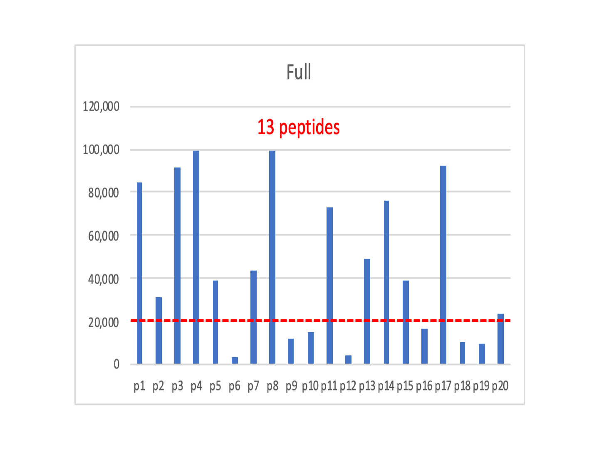
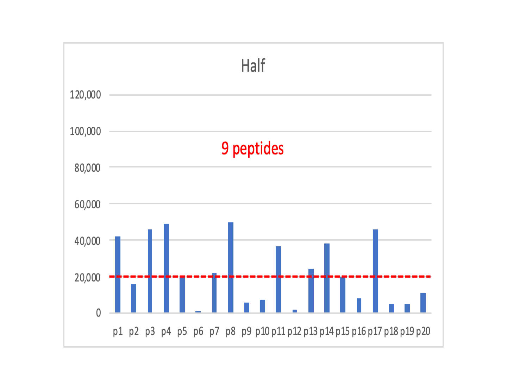
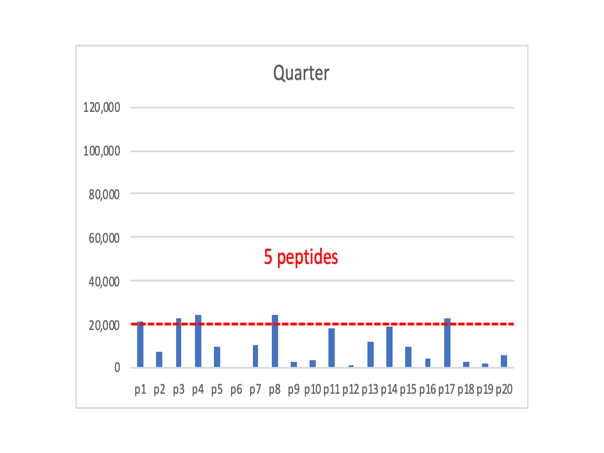

- it is just spectral counting
- two-peptide rule and protein ranking functions
- identifiable versus quantifiable
  - missing data and low abundance cutoff
- grouping pros and cons
  - razor peptide method is not good
- negative controls vs positive controls

## Introduction

This second installment on data plumbing will tackle the interplay between [protein inference](https://www.mcponline.org/content/4/10/1419.short) and quantitative data rollup in shotgun proteomics. TMT labeling will be the example type of data. The discussion will be about the general problem of how we try to put [Humpty Dumpty](https://en.wikipedia.org/wiki/Humpty_Dumpty) back together again; i.e. how do we form protein expression values from measurements of peptide spectrum matches (PSMs) or MS1 features. Please try to not get bogged down in TMT details and lose sight of the general problem.

## Shotgun quantification is all the same

Many people might think [spectral counting](https://pubs.acs.org/doi/abs/10.1021/ac0498563), [intensity-weighted spectral counting](https://pubs.acs.org/doi/abs/10.1021/pr401017h) (also [this reference](https://onlinelibrary.wiley.com/doi/abs/10.1002/pmic.200700426)), [accurate mass and time](https://onlinelibrary-wiley-com.liboff.ohsu.edu/doi/full/10.1002/mas.20071) (AMT) tag methods, [MaxQuant LFQ](https://www.mcponline.org/content/13/9/2513.short), [MaxQuant iBAQ](https://www.nature.com/articles/nature10098), [SILAC](https://www.mcponline.org/content/1/5/376.short), [iTRAQ](https://www.mcponline.org/content/3/12/1154.short), and [TMT](https://pubs.acs.org/doi/abs/10.1021/ac0262560) are all rather different quantitative proteomics techniques. If you take a step back, no - a bigger step, keep going, STOP!, you will see that all shotgun quantitation is just weighted spectral counting. We will pick this up in a minute. First, I need to climb onto my [soapbox](https://en.wikipedia.org/wiki/Soapbox) and

> **Rant against ratios:** We are going to be spending a lot of time talking about rolling up lower level measurements to higher levels (like proteins). We are not going to talk about ratios, median ratios, signal-to-noise ratios, golden ratios, the 80:20 ratio, pi, or any other kind of ratios. Ratios and statistics do not mix (ask any statistician). We want quantitative proteomics to be serious quantitative work; something that uses real statistics so that we can say this result is **[statistically significant](https://www.nature.com/articles/d41586-019-00857-9)**.

> **Ratio drawbacks:** There are few reasons to use ratios and many reasons not to use them. Measurements are made on some natural scale that has physical meaning. We often have good intuition about the data in its natural scale. Ratios change the natural scale. Ratios compress the range of the numbers. Half of the ratios are between 0 and one. The other half are between 1 and infinity. This asymmetry in numerical values is **fixed** by taking the logs of the values. This further compresses the range of values. No one on this planet has any intuition about numbers in reciprocal or logarithmic spaces. There are no good reasons to work with ratios (in most cases) other than this being the poor way that quantitative proteomics has been done in the past.

What all of these methods have in common is that we have proteins in our samples, but we do not make measurements of proteins. We choose to digest the proteins and measure the liberated peptides instead. The question is what are the relationships of the measured peptides to the proteins originally in the sample? The [answer is not 42](https://en.wikipedia.org/wiki/The_Hitchhiker%27s_Guide_to_the_Galaxy_(novel)); it depends on a lot of things.

## Context is everything

A (tryptic) peptide is pretty short, so the amino acid sequence may not be **unique**. Unique is defined in **this context** as the peptide mapping to a single gene product (a protein). It is not a simple case of peptide length for uniqueness; although longer peptide are more likely to be unique.  Nature, unlike humans, tries to recycle things. There are motifs in proteins that do useful things and these tend to be conserved. We can have conserved motifs between different proteins within the same organism and we can have conserved motifs between species.

Higher eukaryotic organisms have genes that produce multiple, similar protein products to increase functional diversity. These protein isoform families can liberate many peptides that are the same. There can be **more complete** (isoforms present) or **canonical** (single gene products) FASTA database choices to make. Most organisms also try to cheat death by having multiple protein coding genes for critical housekeeping functions. The duplicated genes can produce identical or nearly identical gene products. Many peptide sequences identified in shotgun studies can come from more than one protein.

What is the relationship of these **shared** peptides to the proteins, and what can we say about the measured values for these shared peptides? The bottom line is that the **information content** is different for unique and shared peptides. In next generation mRNA sequencing, they just toss out the shared reads. We can have a lot of shared peptides in proteomics, so we generally avoid rejecting them.

Shotgun quantification boils down to how do we define shared and unique peptides, in what context, and what do we do with shared peptides. This becomes a tension between quantitative resolution (how finely can we quantify proteins or even parts of proteins) and trying to recover as much quantitative information from the shared peptides as possible. We worry about the later situation because many proteins in shotgun experiments are not abundant and we have limited measurements for them. Discarding shared peptides too aggressively can compromise the data quality. How we make decisions about the shared peptides depends on the [protein inference](www.mcponline.org/content/4/10/1419.short) process.

> This is how shotgun quantification and protein inference are intimately coupled. You might have a biological question where maintaining lots of quantitative resolution is much more important than trying to reduce noise and simplify the results. Lucky you! You can stop reading this. However, most pipelines such as mine, or Proteome Discoverer, or MaxQuant, or Scaffold are going to make efforts to recover quantitative information from shared peptides. Keep reading if you want to gain some understanding of how that is done.       

## Relevant pipeline steps

I did a blog post [about pipelines](https://pwilmart.github.io/blog/2019/09/08/Keeping-pipeline-flowing) where typical processing steps were outlined. Most upstream steps are about filtering PSMs with some acceptable error rate, typically 1%. If you had 250,000 MS2 scans and could identify 40% of those (these are pretty typical numbers for shotgun experiments on Orbitraps), you would have 100,000 PSMs after filtering out most of the incorrect matches. A 1% FDR implies that there would be 1000 incorrect PSMs. You do not know which of the 100,000 PSMs might be the 1000 incorrect ones. Would you trust the quantitative information from those 1000 PSMs?

### Protein inference

Generally, we combine proteins having (mass spec) indistinguishable sets of matching peptides into single groups, and remove any proteins whose set of peptides can be explained by other proteins (with larger peptide sets). This constitutes basic parsimony principles. We (usually) do not have more than one identical protein sequence in the FASTA protein database file. While the protein sequences tend to always be unique, because we only observe partial sequence coverage, the observed peptides may not be capable of distinguishing proteins. Our ability to distinguish proteins is reduced as sequence coverage decreases. We know that PSM counts are correlated with abundance, so we have better odds of distinguishing abundant proteins (where coverage is higher) compared to lower abundance proteins.

Each biological sample starts with intact proteins that get digested in peptides. Strictly speaking, we should map peptides to proteins separately for each biological sample. We do not  know for sure if peptides coming from different biological samples came from the same protein because we do not know what proteins are present in each different sample yet. Unfortunately, many proteins have few peptides and whether or not those peptides are distinguishable can vary sample-to-sample. This can make aligning identifications between samples challenging.

A strategy that [kills two birds with one stone](https://idioms.thefreedictionary.com/kill+two+birds+with+one+stone) is to collectively map all of the peptides from all of the samples in an experiment-wide protein inference process. This gives more sequence coverage to make identical set and subset calls. It also takes care of aligning protein identifications across all samples in the experiment. We may need to do some per sample cleanup if we have some minimum protein identification criteria to meet. This strategy tends to minimize protein grouping in basic parsimony logic. It can lead to proteins that are indistinguishable in a given sample being reported as distinguishable despite each protein has no unique peptides (this seems rare). Every choice has its consequences.

### Protein error control

As we have moved through the data processing steps, we have reduced the number of PSMs by rejecting the majority of the incorrect matches. We have mapped those peptide sequences to the protein sequences that were in the FASTA file and followed some parsimony rules to simplify the protein list. Remember that we still have incorrect PSMs that might lead to incorrect protein identifications to deal with.  

There are two ways to control the number of incorrect proteins: _ad hoc_ ranking functions or basic probability theory. _Ad hoc_ ranking functions approach the problem like it is similar to the statistical treatment of PSM scores. It is not. While a target or decoy protein counting does give some ballpark estimate of the protein error rate, there are insufficient numbers of target and (especially) decoy proteins for any valid statistical assessment. You would need to know the decoy protein score distribution and that is not possible because nearly all incorrect PSMs have been filtered out.

The process by which incorrect peptide sequences manifest as incorrect protein sequences is not at all like how incorrect PSM scores end up in the correct pile. We all know that the number of peptides per protein is somehow important. That is how the **two-peptide rule** came to pass.  The Supplemental materials for the [MAYU paper](https://www.mcponline.org/content/8/11/2405.short) worked out the basic probability equation.

The formula can be simplified for the typical proteomics case. If we just want to get the gist of how numbers of incorrect proteins depend on numbers of incorrect peptides, we can make some approximations. The number of incorrect peptide sequences are usually much smaller than the number of proteins in the FASTA database. The numbers of incorrect peptides are typically a few hundred to a thousand. The number of proteins in protein databases are typically many tens of thousands. Consequently, one of the terms in the hypergeometric probability equation will be so close to 1.0 that we can drop it. Truncated factorials can be replaced with power expressions (100 x 99 x 98 is pretty close to 100^3). There is explicit dependence on the number of peptides per protein. The number of incorrect proteins drops off so rapidly with increasing numbers of peptides per protein, that explicit forms for 1, 2 or 3 peptides per protein are all that are relevant.

**There are a few key points:**

- there is a direct dependence on number of incorrect peptides
- there is an inverse relationship with the protein database size
- formulae predict the number of incorrect proteins
- single peptide per protein IDs have a one-to-one error relationship
- three peptides per protein error numbers are typically very small
- two peptides per protein is [**the sweet spot**](https://idioms.thefreedictionary.com/the+sweet+spot)

**There are some caveats**
- lengths of the protein sequences are ignored
- database size should be proportional to theoretical peptide search space
- incorrect matches to correct proteins are ignored

> These formulae are in the ballpark if the number of proteins identified in the sample are a reasonably small fraction of the database size. Scalings of the estimates have to be done if the number of protein IDs become too large compared to the target database.

With the typical numbers mentioned above, the 1000 incorrect PSMs would result in 1000 incorrect proteins if we allowed single peptide per protein IDs (without ranking functions and an FDR analysis). We would only have a handful of incorrect proteins (estimate of 25 for a 20,000 sequence protein database) with the two-peptide rule. Protein ranking functions are untested and could suffer from inaccurate error estimates given the fluctuations in counts of small numbers. The two-peptide rule is derived from simple probability theory and effectively controls the number of incorrect proteins.

## Where are we at?

The proteins that the measured data suggest are present in our sample is not a simple subset of the starting FASTA file. We have peptide ambiguity, we have partial sequence coverage, and we have peptide errors.

I want to clearly state that detecting proteoforms, detecting alternative slicing, detecting disease associated mutations, detecting novel protein processing, and detecting novel post-translational modifications are all **extremely important**. However, those are advanced proteomics topics. They are much harder than you have been told. The game is not over once you find one putative PSM that suggests something interesting. That is really more like the pregame warmup. You have to have a hypothesis and an experimental design with controls. You have to **validate everything**. You have to bust your butt to try and prove yourself wrong.

## Do not bite off more than you can chew

A protein expression study is about comparing protein abundance measures between samples. Shotgun techniques are looking at pieces of proteins. The unmodified peptides from a canonical sequence will constitute the vast majority of the peptide signals from each protein. I do not want to burst bubbles here, but that is the reality. Modifications are substoichiometric without enrichment. Most protein isoforms do not have detectible distinguishable peptides unless those proteins are very abundant and the sequence coverage is high. There is nothing to be gained by looking for things that are not there or not abundant enough to matter.

Every rule has exceptions. However, questions about isoforms, variants, PTMs, etc. are separate questions from differential protein expression. They should be explored in independent, separate analyses. If we had extensive PTMs in our samples and the PTMs varied by condition, then not specifying PTMs in the database search will bias the quantitative results. Studies with samples like that will be rare. Some characterization of samples for PTMs and how they vary by condition needs to be done first to see if a quantitative bottom up study can be done for those cases. If PTMs are going to be important, the more abundant one have to be determined and the quantitative experiment altered accordingly. A quantitative shotgun experiment has limitations and is not always the right thing to do. That is why there are other methods like top-down and targeted analyses.

Use a protein grouping or clustering method to combine protein families that have high sequence homology instead of a razor peptide method. Some housekeeping genes have multiple coding regions that make identical or very similar sequences. This redundancy helps keep you alive. It can mean that protein members of families like alpha-tubulins, beta-tubulins, actins, histones, etc. can have few **non-shared** tryptic peptides. Razor peptide methods pick one protein of the family to get all of the shared peptides. The other family members just get a handful of their unique peptides and no shared peptides. That means that one family member gets large quantitative signals and the other family members get small, unreliable values. It is better to remove the poor quality family members by grouping the entire family into a single entity.

## Keep it simple

We need to have robust, simple lists of proteins and their quantitative estimates to compare many samples in typical studies. Aligning protein identifications between samples can be challenging and overly complete (large) protein FASTA files can make that harder. Some protein grouping steps can simplify protein lists when canonical databases are not an option.

Simplified protein lists not only make the differential expression testing easier to do and interpret, most annotation information is gene-centric. It makes sense to have a one gene, one protein relationship when adding annotations. If ortholog mapping needs to be done to a better-annotated species, mapping canonical sequences to canonical sequences is much easier. Most downstream steps rely on minimal ambiguity to work well. Yes, there is some loss of information associated with minimizing ambiguity. There is also some compromise in quantifying **proteins** from their **tryptic peptides**. Some consistency in the compromises of the analysis across the pipeline steps is the workable approach.

## Final Thoughts

I am not proposing that we all do only the lowest common denominator experiments. What fun is that? I am proposing that there is no such thing as a **one and done** analysis. Start with a simple search if doing protein expression and see what you get. Explore other things with additional analyses. Are there non-tryptic peptides in my sample? How abundant are they? Can I ignore them? Are the lots of PTMs in my sample? How abundant are they? Can I ignore them? Are there different protein isoforms present? How abundant are they? Can I ignore them?

---

Phil Wilmarth, September 20, 2019.
