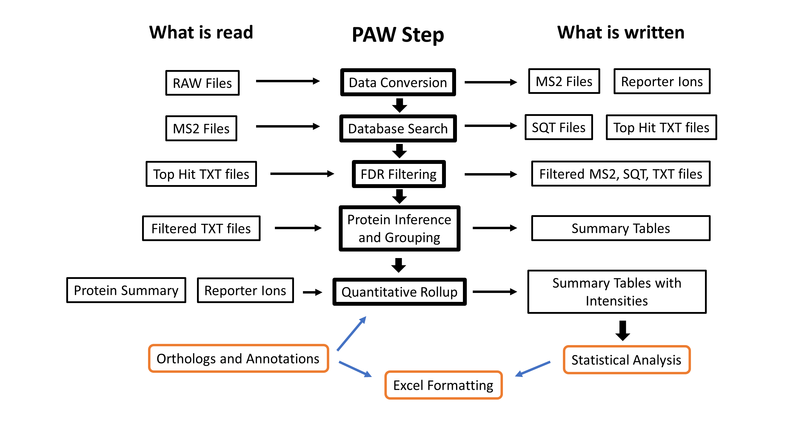

# Go big or go home?

A comparison of narrow parent ion mass tolerances and wide parent ion mass tolerances.

## Introduction

Back on March 26, 2021, I posted a Twitter poll asking what parent ion mass tolerance people though would give the best search engine results. There were 193 votes cast:

Tolerance|Votes
---------|-----
10 PPM|59.1%
50 PPM|18.7%
1.25 Da|8.8%
Something else|13.5%

I occasionally read the literature so I knew what results I was going to see. The narrow tolerance search has won "the Franchise Wars" (movie quite from Demolition Man), so to speak.

The Orbitraps from Thermo were the first wave in high resolution, high mass accuracy instruments to gain popularity. Previous Thermo instruments had been more "mass suggestion" spectrometers and one of the first things Thermo users did with Orbitraps was to adapt previous proteomics tools like SEQUEST to this new world. The first generation instruments were hybrids with the Orbitrap analyzer frequently used for survey scans and the linear ion trap used for the fragmentation and MS2 analysis. This created a situation where the MS2 spectra were largely unchanged from older instruments but the survey scans were very different.

The early tools and tricks of the trade did surprisingly well with nominal masses, which was  what the MS2 spectra still were. It seemed logical that existing search engines could be adapted to the new data because the MS2 data had not changed. What had changed was the precursor ion information. Peptide charge states and monoisotopic masses could finally be known with some confidence. Search engines have parent ion mass tolerance settings, so an obvious question was what parent ion mass tolerance setting to use for Orbitraps. The MacCoss lab asked and answered this question way back in 2010 (see https://pubs.acs.org/doi/abs/10.1021/pr900816a).

> Hsieh, E.J., Hoopmann, M.R., MacLean, B. and MacCoss, M.J., 2010. Comparison of database search strategies for high precursor mass accuracy MS/MS data. Journal of proteome research, 9(2), pp.1138-1143.

The answer was that wide tolerance searches performed better. However, that was so long ago that the computers were evolutionally closer to slide rules than to today's super computers that also function as telephones. Narrow tolerance searches were faster. The convenience of faster searches is what tipped the scales. Convenience is the only factor that drives wide adoption of new tech. And that is where we are today. Sitting in front of idle computers that are hundreds of times faster than a decade ago because the narrow tolerance search finished while you blinked. Now that speed is irrelevant for most uses, maybe it is time to revisit the question of what parent ion mass tolerance performs best for basic uses?

## What data to use?

Now that we have enormous public data repositories, finding data to use to answer questions is no longer a problem. Do we use some artificial concoction because we think we can predict the outcome? Do we use yeast or HeLa cells? (I think yeast and HeLa cells make perfect proteomics datasets as part of their normal cell cycles.) Or do we go all in with less than perfect real world samples? Check out the blog post title if you are unsure of the answer.

How about a wide dynamic range biological fluid (urine) from a rarely studied organism (California sea lions) that we know very little about ([PXD009019](https://www.ebi.ac.uk/pride/archive/projects/PXD009019))? That sounds perfect to me. I had already done a re-analysis of that data in [this repository](https://github.com/pwilmart/Sea_lion_urine_SpC).

> Neely, B.A., Prager, K.C., Bland, A.M., Fontaine, C., Gulland, F.M. and Janech, M.G., 2018. Proteomic analysis of urine from California Sea Lions (Zalophus californianus): A resource for urinary biomarker discovery. Journal of proteome research, 17(9), pp.3281-3291.

Ten of the 19 samples were done in May 2017 and the other 9 were done in June. There were some calibration differences between the two sets of runs. I will work up the 9 June samples here because those runs had better calibration.

## Data processing

The data was analyzed using the [PAW pipeline](https://github.com/pwilmart/PAW_pipeline). A general workflow diagram is shown below.

Data conversion uses `MSConvert.exe` from the [Proteowizard Toolkit](http://proteowizard.sourceforge.net/download.html) and the [Comet search engine](http://comet-ms.sourceforge.net) (version 2016013). Both programs are Windows software and freely available. The rest of the downstream steps are written in Python 3.x and can be run on multiple platforms.

In this exercise, we are changing Comet search parameters that relate to parent ion mass tolerance and counting how many PSMs (peptide-to-spectrum matches) we get at 1% FDR (false discovery rate) determined using the [target/decoy method](https://www.nature.com/articles/nmeth1019). We will explore a series of parent ion mass tolerance setting changes in Comet:

- Different parent ion mass tolerances only
  - 10 parts per million (PPM)
  - 20 PPM
  - 50 PPM
  - 1.25 Daltons (Da)
- Different tolerances with isotopic errors
- Different tolerances with isotopic errors and deamidation

## Monoisotopic peaks, isotopic peaks, and deamidation

> Disclaimer: I do not like ratios. Parts per million is another stupid ratio. Proteomics would be so much better without ratios.

Narrow tolerance searches usually have the delta mass window between measured masses and candidate peptide sequence masses specified in part-per-million (PPM). This means that the parent ion mass tolerance window varies with the peptide mass. Comet works with peptide masses in MH+ units. That is a shortcut for a 1+ ion mass (the peptide molecular weight plus the mass a hydrogen ion). For a 2000 Da peptide, 10 PPM is plus/minus 0.02 Da (0.04 Da for 20 PPM and 0.10 Da for 50 PPM). These are small mass differences.

The mass spectrometer sees peptides as sets of spaced peaks. Ions come in different charge states (like 2+ or 3+) and that results in different m/z values. Each m/z region is not a single peak but a series of peaks separated by the masses of neutrons (1.008 Da) (see https://www.biosyn.com/images/userfiles/image/Monoisotopic%20Mass.jpg or Google "peptide isotopic pattern images"). The first peak of isotopic envelopes is called the monoisotopic peak and is the mass value we want to use for a peptide.

During acquisition, the instrument has to try and find these isotopic patterns in real time to select ions for fragmentation. That is not easy. When peptides get larger, the monoisotopic peak gets smaller and the heavier isotopic peaks get larger. Instruments often miss the first peak (the monoisotopic peak) and mistakenly think the peptide mass is the M1 peak (the first isotopic peak). The second peak can also be mistaken for the monoisotopic peak (this happens less often). These peaks that are 1.008 or 2.016 Da heavier are in the next Zip code when we use narrow tolerance searches and the PPM scale.

We would never score the correct peptide match for these cases unless our search engine was smart enough to know that the instruments can make these very specific errors. Luckily, the folks that write search engine software are pretty smart. They have options to try a set of isotopic errors when using narrow tolerance settings. Instead on a single, very tight window around the measured mass value, several narrow windows are used to cover the isotopic peak locations.

We often add oxidation of methionine residues to searches because this happens during sample processing and is right in the ballpark of being too common to ignore. Deamidation of (mostly) asparagine residues is also a pretty common sample processing artifact, particular for certain motifs. Note deamidation of glutamine is **much** less likely. The mass shift when an amide is converted to an acid is +0.984 Da. This is very similar to the +1.008 Da isotopic peak shifts.

This raises several annoying questions. Should deamidation be added as a variable mod for narrow tolerance searches? Should both Asn and Gln residues have deamidation or just Asn? Will allowing isotopic errors let deamidation be found without having to specify deamidation as a mod? It is hard to know how much deamidation you bench work will introduce. Since it is sequence and residue dependent, it may depend on the proteins in your samples. Deamidation of Gln should not be used (it is not real during any sane protocol). You might get deamidation picked up during the isotopic peak errors if the narrow tolerance is not too narrow. Five or 10 PPM are too narrow. 20 PPM or larger might be okay. How do you know for sure? Exactly. Deamidation is an ugly complication, but **only** for narrow tolerance searches.

## Let's ask the data what to do

Unless we are parked on a bar stool with a  cold beer (okay, the beer can be warm, too), speculation is a waste of time. There is no written rule that I know of that says you cannot analyze the same data in different ways to figure what works best. Instead of clinging to some famous group's highly cited paper's methods section like a lifeboat, you can figure out how to analyze your own data like a true professional scientist. All it costs you is some computer time.

It took proteomics a long time to find the secret sauce for search engine peptide identifications. That secret sauce is the target/decoy method and counting PSMs at a controlled FDR. This is the evaluation metric we need to spread our wings and fly (informaticically speaking).

That is exactly what I did. I tried different Comet setting on the same data and wrote down the numbers of PSMs at 1% FDR. Then I made this table:

Parent ion tolerance|PSMs|PSMs with iso errors|PSMs with iso errors and Deamidation
--------------------|----|--------------------|------------------------------------
10 PPM|81,655|95,311|98,251
20 PPM|81,626|100,554|101,233
50 PPM|86,216|104,751|106,776
1.25 Da|108,826|108,563|109,015

The small print: California sea lion FASTA file, semi-tryptic cleavage with up to 2 missed cleavages, variable met oxidation, static alkylated cys, and high resolution fragment ions.

## The take home message

It is time to outgrow the limitations of the narrow windows and go big with the parent ion tolerance. Not only do you get the best results, you can ignore all of that other stuff (isotopic errors and the deamidation complications). Putting all joking aside, try wide tolerance setting in your workflows and see if you get improvements. Not all tools will let you get the best results, though. Maybe that should be a good reason to find better tools.

Narrow tolerance searches by themselves are quite bad. The reasons are many (I will come back and add more along those lines later). You can make narrow tolerance searches a lot better by allowing isotopic errors. You can get some small further gains with deamidation of N. However, the 1-3% gain is probably small enough to think about skipping. It is clear that 10 PPM is too narrow (as would be tighter tolerances). These very narrow tolerances are sensitive to any mass calibration errors. Mass re-calibration is an option in many tools, but I think it is still risky.

In terms of low risk of screwing up your analyses, 1.25 Da tolerance gives the best numbers independent of parent ion mass tolerance settings. Provided you know how to analyze wide tolerance searches (or your pipeline does), this is a real "set it and forget it" situation. One could say the MacCoss lab got it right eleven years ago (they still do wide tolerance searches, right?) and the proteomics community (cough, cough MaxQuant, PD, etc.) has spent over a decade getting it wrong.

While you are sharpening your arrows so you can shoot the messenger, there can be computational reasons to need narrower tolerances in many applications. Those are more advanced cases. The basic peptide identification and quantification experiments that are the vast majority of use cases could be significantly improved.

## Where are the histograms?

I know. I love looking at them, too. They take forever to make. I have to do GUI window captures for lots of deltamass and peptide classes (every changed Comet parameter is a new set of histograms). Those screen captures have to have regions clipped out. Multi-histogram figures have to be made in PowerPoint. There are lots of files to name, organize, and keep track of. I will get to it one of these days.

The [parent ion mass correction](https://github.com/pwilmart/precursor_mass_corrections) repository is a related topic and has many histograms to check out.

---

Thanks for reading!  
Phil Wilmarth   April 22, 2021
